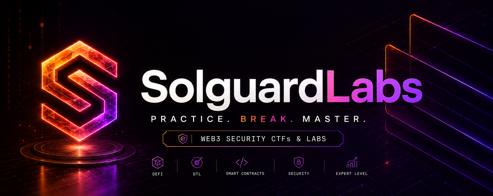

|   # | Lab                                                                              | Language                    | Category                                          |   LOC | Difficulty | Expected findings | Commit         |
| --: | -------------------------------------------------------------------------------- | --------------------------- | ------------------------------------------------- | ----: | ---------- | ----------------: | -------------- |
|   1 | [ArdentBridgeProtocol](https://github.com/SolguardLabs/ArdentBridgeProtocol)     | Solidity + Foundry          | Solidity DeFi bridge CTF                          | 3,970 | Expert+    |                 1 | `114f7d3c95cb` |
|   2 | [AuralisAMMProtocol](https://github.com/SolguardLabs/AuralisAMMProtocol)         | Solidity + Foundry          | Solidity/Foundry AMM protocol CTF                 | 5,196 | Expert+    |                 1 | `0b703c98d0fa` |
|   3 | [AxiomLiquidityProtocol](https://github.com/SolguardLabs/AxiomLiquidityProtocol) | TypeScript + Node tests     | TypeScript managed-liquidity protocol CTF         | 3,167 | Expert+    |                 1 | `e3bc439c0e43` |
|   4 | [EclipseDTL](https://github.com/SolguardLabs/EclipseDTL)                         | Rust + JavaScript tests     | Rust DTL liquidity-auction CTF                    | 5,144 | Expert+    |                 1 | `3da18782106a` |
|   5 | [PrismDTL](https://github.com/SolguardLabs/PrismDTL)                             | Rust + JavaScript tests     | Rust DTL library CTF                              | 2,740 | Advanced   |                 1 | `4ceb9854a5a6` |
|   6 | [VertexDTL](https://github.com/SolguardLabs/VertexDTL)                           | Rust + JavaScript tests     | Rust DTL binary CTF                               | 2,124 | Expert     |                 1 | `f27299ac7b6b` |
|   7 | [ApexDTL](https://github.com/SolguardLabs/ApexDTL)                               | Rust + JavaScript tests     | Rust DTL binary CTF                               | 2,206 | Expert     |                 1 | `bb6c61c489bb` |
|   8 | [AxisDTL](https://github.com/SolguardLabs/AxisDTL)                               | Rust + JavaScript tests     | Rust DTL binary CTF                               | 3,211 | Expert     |                 1 | `01df56f1a32f` |
|   9 | [NexusDTL](https://github.com/SolguardLabs/NexusDTL)                             | Rust + JavaScript tests     | Rust DTL binary CTF                               | 4,206 | Expert+    |                 1 | `d2b4744d4015` |
|  10 | [FusionDTL](https://github.com/SolguardLabs/FusionDTL)                           | Rust + JavaScript tests     | Rust DTL binary CTF                               | 4,125 | Expert+    |                 1 | `5e22032356bb` |
|  11 | [HorizonDTL](https://github.com/SolguardLabs/HorizonDTL)                         | Rust + JavaScript tests     | Rust DTL library CTF                              | 3,166 | Expert+    |                 1 | `94228d5b2af0` |
|  12 | [NocturneDTL](https://github.com/SolguardLabs/NocturneDTL)                       | Rust + JavaScript tests     | Rust DTL privacy-accounting CTF                   | 5,461 | Expert+    |                 1 | `5b435f5c6224` |
|  13 | [OrbitDTL](https://github.com/SolguardLabs/OrbitDTL)                             | Rust + JavaScript tests     | Rust DTL binary CTF                               | 1,702 | Expert     |                 1 | `6e7ba02ecd7c` |
|  14 | [FluxDTL](https://github.com/SolguardLabs/FluxDTL)                               | Rust + JavaScript tests     | Rust DTL binary CTF                               | 1,674 | Expert+    |                 1 | `7ad9a7032338` |
|  15 | [CascadeDTL](https://github.com/SolguardLabs/CascadeDTL)                         | C + JavaScript tests        | C DTL binary CTF                                  | 3,629 | Expert+    |                 1 | `71382913ef6b` |
|  16 | [ObsidianDTL](https://github.com/SolguardLabs/ObsidianDTL)                       | C + JavaScript tests        | C DTL relayer CTF                                 | 3,528 | Expert+    |                 1 | `40e5be790c5c` |
|  17 | [MeridianDTL](https://github.com/SolguardLabs/MeridianDTL)                       | C + JavaScript tests        | C DTL engine CTF                                  | 3,503 | Expert+    |                 1 | `23082678dbae` |
|  18 | [KeystoneDTL](https://github.com/SolguardLabs/KeystoneDTL)                       | C + JavaScript tests        | C DTL library CTF                                 | 3,327 | Expert+    |                 1 | `88736d77c17c` |
|  19 | [SentinelDTL](https://github.com/SolguardLabs/SentinelDTL)                       | C + JavaScript tests        | C DTL binary CTF                                  | 4,047 | Expert+    |                 1 | `c81d7dac0d1c` |
|  20 | [MosaicDTL](https://github.com/SolguardLabs/MosaicDTL)                           | C++ + TypeScript tests      | C++ DTL liquidity-fragmentation CTF               | 4,083 | Expert+    |                 1 | `7dbbda94a1e5` |
|  21 | [TesseractDTL](https://github.com/SolguardLabs/TesseractDTL)                     | C++ + TypeScript tests      | C++ DTL binary CTF                                | 4,142 | Expert+    |                 1 | `52405eeef169` |
|  22 | [PylonDTL](https://github.com/SolguardLabs/PylonDTL)                             | C++17 + JavaScript tests    | C++ DTL engine CTF                                | 4,015 | Expert+    |                 1 | `6deabe658399` |
|  23 | [GraniteDTL](https://github.com/SolguardLabs/GraniteDTL)                         | C++17 + JavaScript tests    | C++ DTL collateral engine CTF                     | 4,011 | Expert+    |                 1 | `a075f04b029e` |
|  24 | [AetherDTL](https://github.com/SolguardLabs/AetherDTL)                           | C++ + TypeScript tests      | C++ DTL intent network CTF                        | 4,011 | Expert+    |                 1 | `f5bce4f77505` |
|  25 | [AuroraDTL](https://github.com/SolguardLabs/AuroraDTL)                           | C++17 + TypeScript tests    | C++ DTL pricing engine CTF                        | 4,007 | Expert+    |                 1 | `bdbfe8136020` |
|  26 | [BastionDTL](https://github.com/SolguardLabs/BastionDTL)                         | C++20 + TypeScript tests    | C++ DTL custody CTF                               | 4,019 | Expert+    |                 1 | `a0467f5d121b` |
|  27 | [CobaltDTL](https://github.com/SolguardLabs/CobaltDTL)                           | C++17 + TypeScript tests    | C++ DTL vault CTF                                 | 4,063 | Expert+    |                 1 | `0fac237ce155` |
|  28 | [AnchorDTL](https://github.com/SolguardLabs/AnchorDTL)                           | Go                          | Go DTL guarantee engine CTF                       | 3,066 | Expert+    |                 1 | `92456bf059fb` |
|  29 | [SolsticeDTL](https://github.com/SolguardLabs/SolsticeDTL)                       | Go + TypeScript tests       | Go DTL settlement-service CTF                     | 3,437 | Expert+    |                 1 | `7e6ca22cab40` |
|  30 | [MonolithDTL](https://github.com/SolguardLabs/MonolithDTL)                       | Go + TypeScript tests       | Go DTL settlement monolith CTF                    | 3,182 | Expert+    |                 1 | `615ba88ffd61` |
|  31 | [DeltaForgeDTL](https://github.com/SolguardLabs/DeltaForgeDTL)                   | Go + TypeScript tests       | Go DTL reconciliation engine CTF                  | 3,109 | Expert+    |                 1 | `f5fe181c4635` |
|  32 | [ZenithDTL](https://github.com/SolguardLabs/ZenithDTL)                           | Go + TypeScript tests       | Go DTL settlement CTF                             | 3,644 | Expert+    |                 1 | `2b764c845487` |
|  33 | [QuarryDTL](https://github.com/SolguardLabs/QuarryDTL)                           | Go + TypeScript tests       | Go DTL liquidity extraction engine CTF            | 3,042 | Expert+    |                 1 | `4ea8dfec5621` |
|  34 | [CompassDTL](https://github.com/SolguardLabs/CompassDTL)                         | Go + TypeScript tests       | Go DTL routing API CTF                            | 3,053 | Expert+    |                 1 | `949994383c01` |
|  35 | [OmenDTL](https://github.com/SolguardLabs/OmenDTL)                               | Go + TypeScript tests       | Go DTL liquidity forecasting engine CTF           | 3,458 | Expert+    |                 1 | `5ad30605bfb8` |
|  36 | [HalcyonDTL](https://github.com/SolguardLabs/HalcyonDTL)                         | Go + TypeScript tests       | Go DTL dynamic funding engine CTF                 | 3,186 | Expert+    |                 1 | `42565d5bbd54` |
|  37 | [NorthstarDTL](https://github.com/SolguardLabs/NorthstarDTL)                     | Go + TypeScript tests       | Go DTL liquidity router CTF                       | 3,009 | Expert+    |                 1 | `fd31adf1756f` |
|  38 | [BastilleDTL](https://github.com/SolguardLabs/BastilleDTL)                       | Go + TypeScript tests       | Go DTL institutional-limits CTF                   | 3,188 | Expert+    |                 1 | `bee606e260f7` |
|  39 | [MarinerDTL](https://github.com/SolguardLabs/MarinerDTL)                         | Go + TypeScript tests       | Go maritime settlement-service CTF                | 3,983 | Expert+    |                 1 | `ce332aa80f57` |
|  40 | [EmberlineDTL](https://github.com/SolguardLabs/EmberlineDTL)                     | Rust + JavaScript tests     | Rust DTL rebate engine CTF                        | 5,888 | Expert+    |                 1 | `e236493575ab` |
|  41 | [TempestDTL](https://github.com/SolguardLabs/TempestDTL)                         | Rust + JavaScript tests     | Rust DTL volatility router CTF                    | 5,765 | Expert+    |                 1 | `3aae0fcac40d` |
|  42 | [StratumDTL](https://github.com/SolguardLabs/StratumDTL)                         | Rust + JavaScript tests     | Rust DTL liquidity-layering library CTF           | 5,013 | Expert+    |                 1 | `2a5f908efc32` |
|  43 | [SableDTL](https://github.com/SolguardLabs/SableDTL)                             | Rust + JavaScript tests     | Rust DTL reconciliation binary CTF                | 5,172 | Expert+    |                 1 | `ba7a9ef41d1c` |
|  44 | [ChronosDTL](https://github.com/SolguardLabs/ChronosDTL)                         | Rust + JavaScript tests     | Rust DTL temporal-settlement library CTF          | 5,174 | Expert+    |                 1 | `ce75c24ebbf2` |
|  45 | [KeystoneXDTL](https://github.com/SolguardLabs/KeystoneXDTL)                     | Rust + JavaScript tests     | Rust DTL internal-lending CTF                     | 5,051 | Expert+    |                 1 | `5ba547a80629` |
|  46 | [EchelonStakingProtocol](https://github.com/SolguardLabs/EchelonStakingProtocol) | Solidity + Foundry tests    | Solidity epoch-staking protocol CTF               | 3,191 | Expert+    |                 1 | `19b7cc78cdf0` |
|  47 | [KairoLendingProtocol](https://github.com/SolguardLabs/KairoLendingProtocol)     | Solidity + Foundry tests    | Solidity multiactive lending protocol CTF         | 3,165 | Expert+    |                 1 | `cb2e303b6016` |
|  48 | [VeloraStableProtocol](https://github.com/SolguardLabs/VeloraStableProtocol)     | Solidity + Foundry tests    | Solidity collateralized-stablecoin protocol CTF   | 3,754 | Expert+    |                 1 | `8de0aba17274` |
|  49 | [SeraphYieldProtocol](https://github.com/SolguardLabs/SeraphYieldProtocol)       | Solidity + Foundry tests    | Solidity yield aggregation protocol CTF           | 3,629 | Expert     |                 1 | `4ab914749984` |
|  50 | [UmbraInsuranceProtocol](https://github.com/SolguardLabs/UmbraInsuranceProtocol) | Solidity + Foundry tests    | Solidity decentralized insurance protocol CTF     | 3,055 | Expert+    |                 1 | `928c214df279` |
|  51 | [VeyraLiquidityProtocol](https://github.com/SolguardLabs/VeyraLiquidityProtocol) | Solidity + Foundry tests    | Solidity concentrated-liquidity protocol CTF      | 3,810 | Expert+    |                 1 | `d9ea18a45d5b` |
|  52 | [MeridianVaultProtocol](https://github.com/SolguardLabs/MeridianVaultProtocol)   | Solidity + Foundry tests    | Solidity ERC-4626 multi-strategy vault CTF        | 3,157 | Expert+    |                 1 | `aace75e3e763` |
|  53 | [AstralCreditProtocol](https://github.com/SolguardLabs/AstralCreditProtocol)     | Solidity + Foundry tests    | Solidity variable-credit market CTF               | 3,441 | Expert+    |                 1 | `a660e7c09f83` |
|  54 | [CipherDebtProtocol](https://github.com/SolguardLabs/CipherDebtProtocol)         | Solidity + Hardhat tests    | Solidity debt-refinancing protocol CTF            | 3,550 | Expert+    |                 1 | `20338637ca42` |
|  55 | [ValiantCreditProtocol](https://github.com/SolguardLabs/ValiantCreditProtocol)   | Solidity + Hardhat tests    | Solidity delegated-credit protocol CTF            | 3,466 | Expert+    |                 1 | `6398d70398eb` |
|  56 | [HelikonStakingProtocol](https://github.com/SolguardLabs/HelikonStakingProtocol) | Vyper + Python tests        | Vyper epoch-staking protocol CTF                  | 3,027 | Expert+    |                 1 | `7a70b76c5633` |
|  57 | [VesperPoolProtocol](https://github.com/SolguardLabs/VesperPoolProtocol)         | Vyper + Python tests        | Vyper low-volatility AMM protocol CTF             | 4,616 | Expert+    |                 1 | `b5158bcc4575` |
|  58 | [AegisInsuranceProtocol](https://github.com/SolguardLabs/AegisInsuranceProtocol) | Vyper + Python tests        | Vyper decentralized insurance protocol CTF        | 3,013 | Expert+    |                 1 | `29864acbc8e1` |
|  59 | [NovaraIndexProtocol](https://github.com/SolguardLabs/NovaraIndexProtocol)       | Vyper + Python tests        | Vyper index-token protocol CTF                    | 3,001 | Expert+    |                 1 | `1f12df8827da` |
|  60 | [PyxisCreditProtocol](https://github.com/SolguardLabs/PyxisCreditProtocol)       | Vyper + Python tests        | Vyper credit-line protocol CTF                    | 3,848 | Expert+    |                 1 | `db077c560cb2` |
|  61 | [ArcadiaTrancheProtocol](https://github.com/SolguardLabs/ArcadiaTrancheProtocol) | Solidity + Foundry tests    | Solidity/Foundry tranche-vault protocol CTF       | 3,468 | Expert+    |                 1 | `5891451dcd5d` |
|  62 | [ArgentDTL](https://github.com/SolguardLabs/ArgentDTL)                           | Go + TypeScript tests       | Go DTL credit-issuance protocol CTF               | 3,470 | Expert+    |                 1 | `1c5ab0836acf` |
|  63 | [ArgentumVaultProtocol](https://github.com/SolguardLabs/ArgentumVaultProtocol)   | Vyper + Python tests        | Vyper stablecoin-vault protocol CTF               | 3,775 | Expert+    |                 1 | `40ae8459eb27` |
|  64 | [BastionCDPProtocol](https://github.com/SolguardLabs/BastionCDPProtocol)         | Solidity + Foundry tests    | Solidity/Foundry CDP protocol CTF                 | 3,566 | Expert+    |                 1 | `45049db2cc47` |
|  65 | [BorealisBondProtocol](https://github.com/SolguardLabs/BorealisBondProtocol)     | TypeScript + Node tests     | TypeScript DeFi bond-desk protocol CTF            | 3,561 | Expert+    |                 1 | `fe682d5aa6fb` |
|  66 | [CalderaOptionsProtocol](https://github.com/SolguardLabs/CalderaOptionsProtocol) | Solidity + Foundry tests    | Solidity/Foundry covered-options protocol CTF     | 3,744 | Expert+    |                 1 | `dea7d3f62927` |
|  67 | [CarmineAuctionProtocol](https://github.com/SolguardLabs/CarmineAuctionProtocol) | Vyper + Python tests        | Vyper liquidation-auction protocol CTF            | 3,376 | Expert+    |                 1 | `93060976e101` |
|  68 | [CitadelDTL](https://github.com/SolguardLabs/CitadelDTL)                         | Go + TypeScript tests       | Go DTL institutional-custody protocol CTF         | 3,286 | Expert+    |                 1 | `b446bab3db14` |
|  69 | [CrownDTL](https://github.com/SolguardLabs/CrownDTL)                             | Rust + JavaScript tests     | Rust DTL priority-redemption protocol CTF         | 5,151 | Expert+    |                 1 | `9175f7ec7f5c` |
|  70 | [DriftDTL](https://github.com/SolguardLabs/DriftDTL)                             | C++ + TypeScript tests      | C++ DTL asynchronous-settlement protocol CTF      | 4,654 | Expert+    |                 1 | `54b09d19d5e4` |
|  71 | [EmberDTL](https://github.com/SolguardLabs/EmberDTL)                             | Go + TypeScript tests       | Go DTL deferred-settlement protocol CTF           | 3,554 | Expert+    |                 1 | `2a3b4f9f0ce5` |
|  72 | [EquinoxMarginProtocol](https://github.com/SolguardLabs/EquinoxMarginProtocol)   | Solidity + Hardhat tests    | Solidity/Hardhat margin-trading protocol CTF      | 3,409 | Expert+    |                 1 | `bbe25e17fd9d` |
|  73 | [HalberdStableProtocol](https://github.com/SolguardLabs/HalberdStableProtocol)   | Vyper + Python tests        | Vyper collateralized-stablecoin protocol CTF      | 3,455 | Expert+    |                 1 | `97c83a24e6d5` |
|  74 | [HeliosRestakeProtocol](https://github.com/SolguardLabs/HeliosRestakeProtocol)   | Solidity + Foundry tests    | Solidity/Foundry restaking protocol CTF           | 3,571 | Expert+    |                 1 | `eefea885cf51` |
|  75 | [HelixDTL](https://github.com/SolguardLabs/HelixDTL)                             | C + JavaScript tests        | C DTL vault-share protocol CTF                    | 2,293 | Expert+    |                 1 | `b5cf53e27818` |
|  76 | [IroncladDTL](https://github.com/SolguardLabs/IroncladDTL)                       | Go + TypeScript tests       | Go DTL reserve-commitment protocol CTF            | 3,378 | Expert+    |                 1 | `c2c98c4b7a4c` |
|  77 | [LatticeDTL](https://github.com/SolguardLabs/LatticeDTL)                         | C + JavaScript tests        | C DTL netting-engine protocol CTF                 | 2,766 | Expert+    |                 1 | `5498b27ad140` |
|  78 | [LumenSwapProtocol](https://github.com/SolguardLabs/LumenSwapProtocol)           | Solidity + Foundry tests    | Solidity/Foundry stable-swap AMM CTF              | 3,459 | Expert+    |                 1 | `a0ae770c589c` |
|  79 | [NovaAuctionProtocol](https://github.com/SolguardLabs/NovaAuctionProtocol)       | Solidity + Foundry tests    | Solidity/Foundry liquidation-auction protocol CTF | 3,798 | Expert+    |                 1 | `1f00a6f06971` |
|  80 | [ObeliskReserveProtocol](https://github.com/SolguardLabs/ObeliskReserveProtocol) | Solidity + Foundry tests    | Solidity/Foundry reserve-stablecoin protocol CTF  | 3,478 | Expert+    |                 1 | `f6c28492d386` |
|  81 | [OryonLendingProtocol](https://github.com/SolguardLabs/OryonLendingProtocol)     | Vyper + Python tests        | Vyper multi-asset lending protocol CTF            | 3,404 | Expert+    |                 1 | `6f6f96d4fb1c` |
|  82 | [PalisadeLeaseProtocol](https://github.com/SolguardLabs/PalisadeLeaseProtocol)   | Solidity + Foundry tests    | Solidity/Foundry productive-lease protocol CTF    | 3,500 | Expert+    |                 1 | `56331c25c667` |
|  83 | [ParallaxDTL](https://github.com/SolguardLabs/ParallaxDTL)                       | C + JavaScript tests        | C DTL liquidity-cell settlement CTF               | 2,490 | Expert+    |                 1 | `91b43a126ac3` |
|  84 | [QuartzPerpsProtocol](https://github.com/SolguardLabs/QuartzPerpsProtocol)       | Solidity + Foundry tests    | Solidity/Foundry perpetuals protocol CTF          | 3,419 | Expert+    |                 1 | `39edfe0ad6c5` |
|  85 | [RelayDTL](https://github.com/SolguardLabs/RelayDTL)                             | Go + TypeScript tests       | Go DTL relayer protocol CTF                       | 3,499 | Expert+    |                 1 | `598cf7ce6acb` |
|  86 | [ReverieBasketProtocol](https://github.com/SolguardLabs/ReverieBasketProtocol)   | Solidity + TypeScript tests | Solidity/Hardhat basket-token protocol CTF        | 3,487 | Expert+    |                 1 | `5b737573b94e` |
|  87 | [RiftDTL](https://github.com/SolguardLabs/RiftDTL)                               | Go + TypeScript tests       | Go DTL distributed-transfer ledger CTF            | 3,420 | Expert+    |                 1 | `6bfd9222763f` |
|  88 | [SolaraIndexProtocol](https://github.com/SolguardLabs/SolaraIndexProtocol)       | Solidity + Foundry tests    | Solidity/Foundry index-token protocol CTF         | 3,416 | Expert+    |                 1 | `13fb9812f459` |
|  89 | [TemporaStreamProtocol](https://github.com/SolguardLabs/TemporaStreamProtocol)   | Solidity + Foundry tests    | Solidity/Foundry payment-stream protocol CTF      | 3,835 | Expert+    |                 1 | `080700c9cb9a` |
|  90 | [VortexDTL](https://github.com/SolguardLabs/VortexDTL)                           | C + JavaScript tests        | C DTL pricing-and-settlement protocol CTF         | 1,485 | Expert+    |                 1 | `b19778d99cce` |
